# 🏗️ Arquitetura Técnica Completa - Cluster AI

## Visão Geral da Arquitetura

O Cluster AI é uma plataforma distribuída de IA que combina processamento paralelo com modelos de linguagem locais, oferecendo uma solução completa para execução de tarefas de IA em ambientes heterogêneos.

## 🏛️ Componentes da Arquitetura

### 1. Camada de Orquestração

#### Dask Scheduler
```python
# Arquitetura do Scheduler
class ClusterScheduler:
    def __init__(self):
        self.workers = {}  # Pool de workers ativos
        self.tasks = Queue()  # Fila de tarefas
        self.resources = ResourceManager()  # Gerenciador de recursos

    def submit_task(self, task: Task) -> Future:
        """Submete tarefa para processamento distribuído"""
        worker = self.select_optimal_worker(task)
        return self.distribute_task(task, worker)

    def select_optimal_worker(self, task: Task) -> Worker:
        """Seleciona worker baseado em recursos e afinidade"""
        return self.resource_manager.optimize_placement(task)
```

**Responsabilidades:**
- Coordenação de tarefas entre workers
- Balanceamento de carga inteligente
- Monitoramento de recursos em tempo real
- Failover automático

#### Resource Manager
```python
class ResourceManager:
    def __init__(self):
        self.cpu_tracker = CPUTracker()
        self.memory_tracker = MemoryTracker()
        self.gpu_tracker = GPUTracker()
        self.network_monitor = NetworkMonitor()

    def get_cluster_status(self) -> ClusterStatus:
        """Retorna status completo do cluster"""
        return {
            'total_workers': len(self.workers),
            'active_tasks': self.tasks.active_count(),
            'cpu_utilization': self.cpu_tracker.average(),
            'memory_usage': self.memory_tracker.total_used(),
            'gpu_available': self.gpu_tracker.available_count()
        }
```

### 2. Camada de Execução

#### Ollama Engine
```python
class OllamaEngine:
    def __init__(self, model_name: str):
        self.model = self.load_model(model_name)
        self.context_manager = ContextManager()
        self.performance_monitor = PerformanceMonitor()

    async def generate(self, prompt: str, **kwargs) -> str:
        """Geração de texto com modelo local"""
        start_time = time.time()

        # Otimização de contexto
        optimized_prompt = self.context_manager.optimize(prompt)

        # Inferência com monitoramento
        with self.performance_monitor:
            response = await self.model.generate(optimized_prompt, **kwargs)

        # Logging de performance
        self.log_performance(time.time() - start_time)

        return response
```

**Características Técnicas:**
- **Modelos Suportados**: Llama, Mistral, CodeLlama, etc.
- **Otimização**: Quantização 4-bit/8-bit
- **Cache**: Sistema de cache inteligente de KV
- **Streaming**: Respostas em tempo real

#### Worker Nodes
```python
class WorkerNode:
    def __init__(self, worker_id: str, capabilities: dict):
        self.id = worker_id
        self.capabilities = capabilities
        self.task_queue = asyncio.Queue()
        self.resource_limits = self.detect_limits()

    async def execute_task(self, task: Task) -> Result:
        """Executa tarefa com isolamento de recursos"""
        async with self.resource_context(task.resources):
            if task.type == 'ai_inference':
                return await self.ollama_engine.generate(task.prompt)
            elif task.type == 'data_processing':
                return await self.dask_worker.process(task.data)
            else:
                return await self.custom_executor.run(task)
```

### 3. Camada de Interface

#### OpenWebUI Integration
```python
class OpenWebUIIntegration:
    def __init__(self, cluster_client: ClusterClient):
        self.cluster = cluster_client
        self.session_manager = SessionManager()
        self.prompt_templates = TemplateManager()

    @app.route('/api/chat', methods=['POST'])
    async def handle_chat(self, request: Request) -> Response:
        """Processa requisições de chat"""
        user_input = request.json.get('message')
        model = request.json.get('model', 'default')

        # Distribuição inteligente
        if self.should_distribute(user_input):
            return await self.cluster.distribute_generation(user_input, model)
        else:
            return await self.local_generation(user_input, model)
```

#### REST API
```python
# API Endpoints
@app.route('/api/v1/models', methods=['GET'])
def list_models():
    """Lista modelos disponíveis no cluster"""
    return jsonify({
        'models': cluster.get_available_models(),
        'status': 'active'
    })

@app.route('/api/v1/generate', methods=['POST'])
async def generate_text():
    """Endpoint para geração de texto"""
    data = request.get_json()
    result = await cluster.generate(data['prompt'], **data.get('options', {}))
    return jsonify({'response': result})

@app.route('/api/v1/cluster/status', methods=['GET'])
def cluster_status():
    """Status completo do cluster"""
    return jsonify(cluster.resource_manager.get_cluster_status())
```

### 4. Camada de Persistência

#### Configuration Management
```python
class ConfigurationManager:
    def __init__(self):
        self.config_file = 'cluster.yaml'
        self.backup_manager = BackupManager()
        self.validation_engine = ConfigValidator()

    def load_config(self) -> dict:
        """Carrega configuração com validação"""
        config = self.parse_yaml(self.config_file)
        self.validation_engine.validate(config)
        return config

    def save_config(self, config: dict):
        """Salva configuração com backup automático"""
        self.backup_manager.create_backup(self.config_file)
        self.write_yaml(config, self.config_file)
```

#### Model Registry
```python
class ModelRegistry:
    def __init__(self):
        self.models = {}  # Cache de modelos carregados
        self.metadata_store = MetadataStore()
        self.download_manager = ModelDownloader()

    async def get_model(self, model_name: str) -> AIModel:
        """Obtém modelo com cache inteligente"""
        if model_name not in self.models:
            await self.load_model(model_name)

        return self.models[model_name]

    async def load_model(self, model_name: str):
        """Carrega modelo com progresso e otimização"""
        metadata = self.metadata_store.get_metadata(model_name)

        async with self.download_manager.download(model_name) as model_path:
            self.models[model_name] = await self.initialize_model(model_path, metadata)
```

## 🔄 Fluxos de Dados

### Fluxo de Geração de Texto

```mermaid
sequenceDiagram
    participant U as Usuário
    participant W as OpenWebUI
    participant C as Cluster Manager
    participant S as Dask Scheduler
    participant O as Ollama Worker
    participant M as Modelo IA

    U->>W: Envia prompt
    W->>C: Requisição de geração
    C->>S: Distribui tarefa
    S->>O: Executa em worker
    O->>M: Inferência IA
    M-->>O: Resposta gerada
    O-->>S: Retorna resultado
    S-->>C: Resultado final
    C-->>W: Resposta para UI
    W-->>U: Exibe resposta
```


### Fluxo de Auto-Discovery


## 📊 Monitoramento e Observabilidade

### Métricas Coletadas
```python
METRICS = {
    'cluster': {
        'active_workers': Gauge('cluster_active_workers'),
        'total_tasks': Counter('cluster_total_tasks'),
        'failed_tasks': Counter('cluster_failed_tasks'),
        'avg_response_time': Histogram('cluster_response_time')
    },
    'worker': {
        'cpu_usage': Gauge('worker_cpu_usage'),
        'memory_usage': Gauge('worker_memory_usage'),
        'gpu_memory': Gauge('worker_gpu_memory'),
        'active_tasks': Gauge('worker_active_tasks')
    },
    'model': {
        'inference_time': Histogram('model_inference_time'),
        'tokens_generated': Counter('model_tokens_generated'),
        'model_load_time': Histogram('model_load_time'),
        'cache_hit_rate': Gauge('model_cache_hit_rate')
    }
}
```

### Dashboards
- **Dask Dashboard**: Interface nativa do Dask para monitoramento
- **Custom Dashboard**: Métricas específicas do Cluster AI
- **Resource Dashboard**: Visualização de recursos por worker
- **Performance Dashboard**: Análise de performance histórica

## 🔒 Segurança e Conformidade

### Autenticação e Autorização
```python
class SecurityManager:
    def __init__(self):
        self.auth_provider = JWTAuthProvider()
        self.rbac = RoleBasedAccessControl()
        self.audit_logger = AuditLogger()

    def authenticate_request(self, request: Request) -> User:
        """Autentica requisição HTTP"""
        token = self.extract_token(request)
        user = self.auth_provider.validate_token(token)
        self.audit_logger.log_access(user, request)
        return user

    def authorize_action(self, user: User, action: str, resource: str) -> bool:
        """Verifica permissões do usuário"""
        return self.rbac.has_permission(user.role, action, resource)
```

### Criptografia
- **Em Trânsito**: TLS 1.3 para todas as comunicações
- **Em Repouso**: Criptografia AES-256 para dados sensíveis
- **Chaves**: Gerenciamento automático com rotação

## 🚀 Estratégias de Escalabilidade

### Horizontal Scaling
```python
class AutoScaler:
    def __init__(self, cluster_manager: ClusterManager):
        self.cluster = cluster_manager
        self.scaling_policies = ScalingPolicies()
        self.resource_predictor = ResourcePredictor()

    async def evaluate_scaling(self):
        """Avalia necessidade de escalabilidade"""
        current_load = self.cluster.get_current_load()
        predicted_load = self.resource_predictor.predict()

        if self.should_scale_up(current_load, predicted_load):
            await self.scale_up()
        elif self.should_scale_down(current_load):
            await self.scale_down()
```

### Load Balancing
- **Round Robin**: Distribuição uniforme
- **Least Loaded**: Baseado em carga atual
- **Resource Aware**: Considerando capacidades específicas
- **Affinity Based**: Para tarefas relacionadas

## 🔧 APIs Técnicas

### Cluster Management API
```typescript
interface ClusterAPI {
  // Gerenciamento de Workers
  registerWorker(worker: WorkerInfo): Promise<WorkerID>
  unregisterWorker(workerId: WorkerID): Promise<void>
  getWorkerStatus(workerId: WorkerID): Promise<WorkerStatus>

  // Gerenciamento de Tarefas
  submitTask(task: Task): Promise<TaskID>
  cancelTask(taskId: TaskID): Promise<void>
  getTaskStatus(taskId: TaskID): Promise<TaskStatus>

  // Monitoramento
  getClusterMetrics(): Promise<ClusterMetrics>
  getWorkerMetrics(workerId: WorkerID): Promise<WorkerMetrics>
}
```

### Model Management API
```typescript
interface ModelAPI {
  // Gerenciamento de Modelos
  listModels(): Promise<ModelInfo[]>
  loadModel(modelName: string): Promise<ModelHandle>
  unloadModel(modelHandle: ModelHandle): Promise<void>

  // Inferência
  generateText(prompt: string, options?: GenerationOptions): Promise<string>
  generateStream(prompt: string, options?: GenerationOptions): AsyncIterable<string>

  // Configuração
  updateModelConfig(modelHandle: ModelHandle, config: ModelConfig): Promise<void>
  getModelMetadata(modelName: string): Promise<ModelMetadata>
}
```

## 📈 Performance e Otimização

### Otimizações Implementadas
- **Cache Inteligente**: Cache de KV para transformers
- **Quantização**: Redução de precisão para menor uso de memória
- **Batch Processing**: Processamento em lote para eficiência
- **Memory Pooling**: Reutilização de memória alocada
- **GPU Optimization**: Uso otimizado de CUDA/cuDNN

### Benchmarks de Performance
```python
BENCHMARKS = {
    'llama_7b': {
        'tokens_per_second': 45.2,
        'memory_usage': '4.1GB',
        'warmup_time': '12.3s'
    },
    'mistral_7b': {
        'tokens_per_second': 52.1,
        'memory_usage': '4.3GB',
        'warmup_time': '10.8s'
    },
    'codellama_13b': {
        'tokens_per_second': 28.7,
        'memory_usage': '7.2GB',
        'warmup_time': '18.9s'
    }
}
```

## 🔄 Processo de Deployment

### Estratégias de Deployment
1. **Blue-Green**: Zero downtime deployments
2. **Canary**: Deploy gradual com monitoramento
3. **Rolling**: Atualização progressiva dos workers
4. **Immutable**: Containers imutáveis

### Configuração como Código
```yaml
# cluster.yaml
version: '1.0'
cluster:
  name: 'production-cluster'
  scheduler:
    host: 'scheduler.cluster.ai'
    port: 8786
  workers:
    - name: 'gpu-worker-01'
      resources:
        gpu: 1
        cpu: 8
        memory: '32GB'
    - name: 'cpu-worker-01'
      resources:
        cpu: 16
        memory: '64GB'
  models:
    - name: 'llama2:13b'
      replicas: 2
      resources:
        gpu_memory: '8GB'
```

Esta arquitetura técnica fornece uma base sólida para o entendimento e manutenção do sistema Cluster AI, garantindo escalabilidade, performance e confiabilidade.
